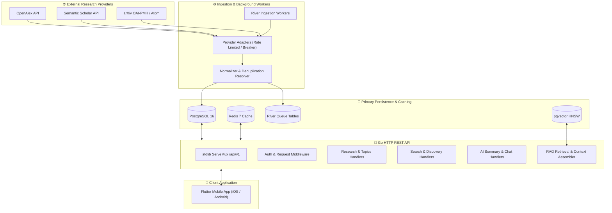

# 🏛️ Athena

<div align="center">

**Discover. Understand. Question. Connect.**

*An intelligent, multi-provider research discovery and learning platform powered by grounded AI.*

[](https://go.dev/)
[](https://flutter.dev/)
[](https://www.postgresql.org/)
[](https://redis.io/)
[-5C4EE5?style=flat)](https://riverqueue.com/)
[](docs/architecture/overview.md)
[](LICENSE)

[Vision](#-vision) •
[Core Features](#-core-features) •
[Architecture](#-system-architecture) •
[Tech Stack](#-technology-stack--design-rationale) •
[Getting Started](#-getting-started) •
[API Specification](#-api-specification) •
[Roadmap](#-phased-roadmap)

</div>

---

## 🌟 Vision

Academic research is expanding exponentially, but discovering, comprehending, and synthesizing scientific papers remains arduous. Research is fragmented across isolated publisher silos, laden with domain-specific jargon, and disconnected from interactive learning tools. Meanwhile, generic LLM assistants frequently hallucinate citations, invent methodologies, and misrepresent scientific findings.

**Athena** solves this by bridging the gap between raw scientific literature and intuitive understanding. It is **not** merely a PDF search engine—it is an intelligent research companion designed around four fundamental pillars:

```text
┌─────────────────┐     ┌──────────────────┐     ┌──────────────────┐     ┌─────────────────┐
│   🔍 DISCOVER   │ ──> │  💡 UNDERSTAND   │ ──> │   💬 QUESTION    │ ──> │   🕸️ CONNECT    │
│ Real-time feeds │     │ Multi-level AI   │     │ Grounded RAG Q&A │     │ Citation graphs │
│ Federated search│     │ structured TL;DR │     │ Strict citations │     │ Stance analysis │
└─────────────────┘     └──────────────────┘     └──────────────────┘     └─────────────────┘
```

1. **Discover** — Aggregate millions of papers across OpenAlex, Semantic Scholar, and arXiv into a unified, deduplicated corpus with real-time feeds and hybrid search.
2. **Understand** — Deconstruct complex academic papers into structured, multi-level explanations tailored from high-school level to domain expert.
3. **Question** — Interactively query papers through a Retrieval-Augmented Generation (RAG) pipeline that guarantees citation-backed answers and explicitly refuses unsupported claims.
4. **Connect** — Traverse bidirectional citation graphs, discover related literature, and map supporting vs. contradicting stances across scientific domains.

---

## ✨ Core Features

### 📡 Multi-Provider Research Aggregation
- **Federated Ingestion**: High-throughput background ingestion engine harvesting from **OpenAlex**, **Semantic Scholar**, and **arXiv** (with Crossref, PubMed, and Europe PMC planned).
- **Deterministic Deduplication**: Multi-key resolution algorithm matching DOIs, arXiv IDs, PubMed IDs, Corpus IDs, and normalized title/author hashes to prevent duplicate records.
- **Resilient Transport**: Distributed rate limiters, token buckets, exponential backoff retries, and circuit breakers with live Prometheus metrics.

### 🔍 Hybrid Search & Discovery Engine
- **Multi-Modal Retrieval**: Combines PostgreSQL weighted Full-Text Search (`tsvector` + GIN), Trigram fuzzy matching (`pg_trgm`), and vector similarity search (`pgvector` HNSW).
- **Reciprocal Rank Fusion (RRF)**: Fuses lexical keyword matches with semantic embeddings to maximize retrieval precision.
- **Dynamic Filtering & Caching**: Filter by publication date, topic taxonomy, author, venue, open-access status, and citation counts, accelerated by Redis multi-tier caching.

### 🤖 Grounded AI & RAG Pipeline
- **Adaptive Summaries**: Generates 4-tier structured summaries (TL;DR, Simple, Academic, Deep-Dive) with key findings, methodology, results, limitations, and practical implications.
- **Zero-Token Cache**: Content-hash keyed summary cache delivering zero-latency, zero-token cost repeat requests.
- **Strictly Grounded Chat**: SSE streaming chat with section-aware chunk retrieval. AI responses strictly cite chunk indices (`[chunk N]`) and explicitly state *"The paper does not provide sufficient evidence to answer this question"* instead of hallucinating.
- **Open-Access Text Extraction**: Clean, compliant full-text extraction from open-access PDFs and preprints with strict licensing policies ([ADR-0010](docs/adr/0010-content-access-licensing-policy.md)).

### 📱 Modern Cross-Platform Mobile Experience
- **Flutter Native Performance**: High-performance iOS and Android client engineered with Flutter and Dart.
- **Feature-First Architecture**: Built on clean domain boundaries with compile-safe state management powered by Riverpod.
- **Deep Linking**: First-class URI scheme handling (`athena://paper/{id}`) for direct navigation to paper details, summaries, and chat sessions.

---

## 🏗️ System Architecture

Athena follows the **Clean Architecture** (Ports and Adapters / Hexagonal) paradigm within a **Modular Monolith**. The core business domain is completely isolated from frameworks, databases, and third-party APIs.

### High-Level Data Flow



### Backend Layering (Go)

```text
backend/
├── cmd/
│   ├── api/                    # HTTP REST API composition root & server entrypoint
│   ├── worker/                 # River background queue worker daemon
│   └── searchbench/            # Relevance & latency benchmarking CLI
├── internal/
│   ├── domain/                 # Core business domain (zero external dependencies)
│   │   ├── research/           # Paper, Author, Identifier, Source entities & ports
│   │   ├── ai/                 # LLMProvider, EmbeddingProvider ports & models
│   │   ├── search/             # Search query models, filters, & searcher ports
│   │   └── user/               # User account & authentication entities
│   ├── application/            # Application use cases & orchestration
│   │   ├── ingestion/          # Ingestion coordinator & window batching
│   │   ├── ai/                 # RAG indexing, chunking, & summary service
│   │   ├── chat/               # Grounded interactive conversation service
│   │   ├── search/             # Federated & database search orchestrator
│   │   └── feed/               # Latest & trending feed generation
│   ├── infrastructure/         # External integrations & adapter implementations
│   │   ├── database/           # pgxpool PostgreSQL repositories & queries
│   │   ├── cache/              # Redis client, keying, & invalidation
│   │   ├── providers/          # arXiv, OpenAlex, Semantic Scholar HTTP adapters
│   │   ├── ai/                 # OpenAI-compatible LLM & embedding clients
│   │   ├── workers/            # River job worker definitions
│   │   └── textextract/        # PDF text extraction & normalization
│   ├── platform/               # Cross-cutting concerns
│   │   ├── config/             # Typed environment configuration & validation
│   │   ├── logger/             # Structured slog logger (JSON & text formats)
│   │   └── httpserver/         # Routing, middleware chain, & probe assembly
│   └── delivery/http/          # HTTP transport layer
│       └── v1/                 # REST v1 handlers, DTOs, & RFC-7807 responses
└── migrations/                 # Sequential SQL migrations (golang-migrate)
```

---

## 🛠️ Technology Stack & Design Rationale

| Component | Technology | Rationale & Architectural Decisions |
|---|---|---|
| **Backend Runtime** | **Go (1.26)** | High-throughput concurrent worker model, minimal memory footprint, instant startup time, single static binaries. |
| **HTTP Server** | **Standard Library `net/http`** | Clean routing with Go 1.22+ method/pattern matching; zero external HTTP dependencies ([ADR-0007](docs/adr/0007-http-stdlib-router.md)). |
| **Primary Datastore** | **PostgreSQL 16** | Relational integrity for citations/authors, native JSONB for raw payloads, full-text search, single operational surface ([ADR-0003](docs/adr/0003-postgresql-primary-datastore.md)). |
| **Vector Search** | **pgvector** | HNSW vector indexing co-located with relational paper data, enabling atomic joins and transactions without external vector DB complexity ([ADR-0005](docs/adr/0005-search-strategy-postgres-first.md)). |
| **Background Jobs** | **River** | PostgreSQL-backed job queue allowing transactional job enqueueing (`pgx.Tx`), deterministic state management, and periodic cron scheduling ([ADR-0006](docs/adr/0006-background-jobs-river-postgres.md)). |
| **Caching Layer** | **Redis 7** | Sub-millisecond latency for hot feed sections, keyword search queries, and distributed rate limiting. |
| **AI Integration** | **Provider-Agnostic LLM/Embedding** | Pluggable OpenAI-compatible and local model adapters with mock implementations for zero-cost offline development ([ADR-0004](docs/adr/0004-ai-provider-abstraction.md)). |
| **Mobile App** | **Flutter / Dart** | Single expressive codebase for iOS & Android with custom platform integration ([ADR-0008](docs/adr/0008-flutter-stack-riverpod-gorouter.md)). |
| **State Management** | **Riverpod 2** | Compile-safe dependency injection, testable without widget tree bindings, reactive state notification. |
| **Observability** | **Prometheus & slog** | Structured JSON logging with trace propagation and Prometheus metric counters for ingestion and circuit breaker states. |

---

## 📂 Repository Structure

```text
.
├── backend/                    # Go backend application (Clean Architecture)
│   ├── cmd/                    # Application binaries (api, worker, searchbench)
│   ├── configs/                # Configuration templates & samples
│   ├── internal/               # Internal packages (domain, application, infra, delivery)
│   ├── migrations/             # golang-migrate SQL migration files
│   ├── Dockerfile              # Multi-stage production container build
│   └── Makefile                # Backend-specific build targets
├── mobile/                     # Flutter mobile application
│   ├── lib/                    # Application source (core, features, presentation)
│   ├── test/                   # Unit, widget, and contract integration tests
│   └── pubspec.yaml            # Dart/Flutter dependency manifest
├── docs/                       # Comprehensive documentation suite
│   ├── adr/                    # Architecture Decision Records (0001–0010)
│   ├── architecture/           # Technical architecture specifications & diagrams
│   ├── api/                    # REST API specifications & request/response schemas
│   ├── database/               # Relational entity-relationship schema documentation
│   ├── conventions/            # Go and Flutter code style guidelines
│   ├── environment.md          # Environment variable reference
│   └── roadmap.md              # Milestone delivery tracking with acceptance criteria
├── docker-compose.yml          # Local containerized infrastructure (Postgres, Redis)
├── Makefile                    # Root project workflow automation
└── README.md                   # Project overview & documentation
```

---

## 🚀 Getting Started

### Prerequisites
- **Go**: `≥ 1.26`
- **Docker & Docker Compose v2**: Installed and running
- **Flutter SDK**: `≥ 3.41` (optional for mobile development)
- **Make**: Recommended for running convenience commands

### 1. Clone the Repository & Configure Environment

```bash
git clone https://github.com/Bereke1t2/Athena.git
cd Athena

# Create your local environment file
cp .env.example .env
```

Review `.env` and configure your API keys if available (e.g., `SEMANTICSCHOLAR_API_KEY`, `OPENALEX_MAILTO`, `LLM_API_KEY`).

### 2. Start Infrastructure Services

Spin up PostgreSQL 16 (with pgvector) and Redis 7:

```bash
make up
```

### 3. Run Database Migrations

Apply all database schema and River queue migrations:

```bash
make migrate-up
```

### 4. Start the Backend API Server

```bash
cd backend
go run ./cmd/api
```

The API will start listening on `http://localhost:8080`. Verify the health probe:

```bash
curl http://localhost:8080/healthz
# Response: {"status":"ok"}
```

### 5. Start Background Ingestion Worker (Optional)

In a separate terminal, launch the background worker daemon to process ingestion jobs:

```bash
cd backend
go run ./cmd/worker
```

### 6. Run the Flutter Mobile App

```bash
cd mobile
flutter pub get
flutter run
```

---

## 📑 API Specification

The API conforms to standard REST principles, using RFC-7807 problem details for errors and returning unique `X-Request-ID` headers.

| Method | Endpoint | Description |
|---|---|---|
| `GET` | `/healthz` | Liveness health check |
| `GET` | `/readyz` | Readiness probe verifying database & cache connectivity |
| `GET` | `/metrics` | Prometheus observability metrics |
| `GET` | `/api/v1/research/papers` | Paginated paper catalog with multi-field filtering & sorting |
| `GET` | `/api/v1/research/papers/{id}` | Detailed paper view by UUID, DOI, or arXiv ID |
| `GET` | `/api/v1/research/papers/{id}/citations` | Inbound & outbound citation edge graph |
| `GET` | `/api/v1/research/papers/{id}/related` | Algorithmically related papers based on shared taxonomy |
| `POST` | `/api/v1/admin/ingestion/jobs` | Enqueue an ingestion synchronization window (*Admin token required*) |
| `GET` | `/api/v1/admin/ingestion/jobs` | Inspect River background job queue status (*Admin token required*) |

For full endpoint specifications, query parameters, and JSON payloads, refer to [docs/api/api-specification.md](docs/api/api-specification.md).

---

## 🧪 Testing & Verification

Athena maintains comprehensive automated test suites across all layers.

```bash
# Run all Go backend unit tests
make test-backend

# Run static analysis and vet
make vet

# Execute Flutter mobile tests
make mobile-test

# Verify end-to-end compose and code readiness
make verify
```

---

## 🗺️ Phased Roadmap

| Phase | Milestone | Focus Areas | Status |
|:---:|---|---|:---:|
| **Phase 0** | **Architecture & Documentation** | Modular monolith design, 10 ADRs, schema DDL, API contracts, environment setup | ✅ Completed |
| **Phase 1** | **Research Aggregation (Backend)** | OpenAlex, arXiv, Semantic Scholar adapters, deduplication, PaperStore, River workers, REST API | ✅ Completed |
| **Phase 2** | **Search & Discovery (Backend)** | Full-text search (tsvector + trigram), topic taxonomy, Redis caching, feed generation | 🔄 Planned |
| **Phase 3** | **Flutter Foundation (Mobile)** | Feature-first mobile client, Riverpod state, deep linking, paper detail & reader screens | 🔄 Planned |
| **Phase 4** | **AI Layer & RAG Pipeline** | pgvector embeddings, hybrid RRF retrieval, 4-tier summaries, citation-grounded SSE chat | 🔄 Planned |
| **Phase 5** | **Personalization & Accounts** | User authentication, bookmarks, followed topics, personalized recommendation feeds | 🔮 Future |
| **Phase 6** | **Advanced Research Intelligence** | Multi-paper comparison, citation graph traversal, agreement/contradiction stance analysis | 🔮 Future |

Detailed criteria and progress logs can be tracked in [docs/roadmap.md](docs/roadmap.md).

---

## 📄 License & Compliance

Athena is released under the [MIT License](LICENSE).

All bibliographic metadata and research data aggregated by Athena adhere to publisher licensing terms and open-access policies. For full details on our content usage and storage practices, consult [ADR-0010: Content Access & Licensing Policy](docs/adr/0010-content-access-licensing-policy.md).
